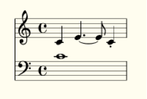
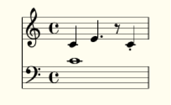
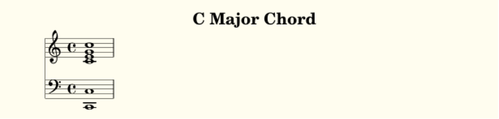
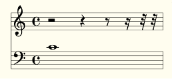
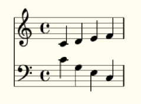
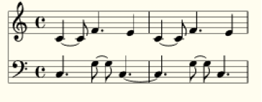
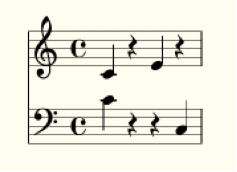
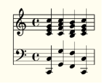

The basics
================

Pieces
--------------

When a piece of music is written in LilyLib, it is written as a subclass of the LilyLib class *Piece*. *Piece* is a somewhat powerful class, and you can see the source code in *piece.py*, but for now, we'll look at the two functions all custom pieces must overwrite; *details* and *write_score*. To illustrate, here's the code for a piece that is just middle C played in both hands:

::

	from piece import Piece
	from points import note


	class MiddleC(Piece):

	    def details(self):
	        self.title = "Middle C"

	    def write_score(self):
	        self.score["treble"] = note("c`", 1)
	        self.score["bass"] = note("c`", 1)


	if __name__ == "__main__":
	    MiddleC()


This is what this looks like when it's compiled (via Lilypond) to a pdf:

.. image:: _static/middle_c.png

Let’s go through this line by line. First we import the base class Piece from LilyLib.

::

	from piece import Piece

This is critical because otherwise python doesn’t know what a Piece is. We also import a function called *note*, but we'll come back to this later. The next line is more python syntax that declares our intention to make a new Piece:

::

	class MiddleC(Piece):

We’ve imaginatively called our *Piece* *MiddleC* and we tag *(Piece)* on the end to let python know that *MiddleC* is a kind of *Piece*. If this is confusing to you, you should take an intro to python course and then everything will become clear.

Our new piece contains two functions: *details* and *write_score*. These contain the meta-data and the musical content of the piece respectively and all pieces must have them. In the details function here we are titling our piece “Middle C”, this is the text that will appear at the top of the pdf after compilation, but we can set other things too. To see what, open *piece.py* and look at the *__init__* function right at the top:

::

	class Piece:

	    def __init__(self):
            self.title = ""
            self.subtitle = ""
            self.composer = ""
            self.date = ""
            self.mutopiacomposer = ""
            self.mutopiainstrument = "piano"
            self.source = ""
            self.style = ""
            self.license = "Creative Commons Attribution-ShareAlike 4.0"
            self.maintainer = ""
            self.mantainer_email = ""
            self.opus = ""
            self.staves = [Treble(), Bass()]
            self.tempo = "4/4"
            self.key = "C Major"
            self.score = {}
            self.auto_add_bars = False

	        self.details()

	        self.set_key(self.key)
	        print(self)

From top to bottom this function sets default values for things like the title, subtitle, composer, tempo, key signature and so on, and it then calls *self.details()* to give you the opportunity to change as many of them as you want in your own piece. This is what the demo above does; it uses the *details* function to add a title, but leaves the tempo and key signature at their defaults.

.. NOTE::
    Don't worry if you are not sure what some of the more esoteric variables do (e.g. *mutopiacomposer*) as they typically relate to esoteric purposes. Instead, just remember that you can use the *details* function to change any of these values for your own piece and you can look inside *piece.py* to see the full list of options.

The *write_score* function does most of the work though, and for complex pieces it will get quite complex too. But, whatever the piece is, the requirement is that it modifies the score of the *Piece* (referred to as *self.score*) adding the contents of the staves as a list of notes, rest, chords, and so on. Here our piece has the default staves: one treble, one bass. We refer to these staves by name (*self.score["treble"]* and *self.score["bass"]*) and give them both a single press of middle C.

::

    def write_score(self):
        self.score["treble"] = note("c`", 1)
    	self.score["bass"] = note("c`", 1)

In this demo, we write the score using the function *note*. This function can be found in *points.py* (it is imported at the top of the demo) and, as the name suggests, it makes notes, one at a time. Here, both staves get the note c`, which is lilypond notation for middle c. They're also given duration 1 which corresponds to a semibreve.

The last bit of code:

::

	if __name__ == "__main__":
	    MiddleC()

is just python for "when this file runs, run the MiddleC class". This ensures that when the file is executed, it prints out the lilypond for the piece. You'll want the same bit of code (swapping out the class name for whatever you called your piece) at the end of any pieces you write.


Single notes, chords and rests
---------------------------------

The above demo uses the *note* function to create a single note. In general, LilyLib discourages the use of atomistic functions like this, in favor of higher-level functions we'll come to later. However, we'll look at a few low-level functions first to get comfortable with what's going on under-the-hood. The function *note* takes at least two arguments: the tone of the note (effectively the "name" of the sound produced; a combination of letter, accent and pitch) and the duration of the note. We will cover tones in more detail below, but simple durations can be integers or strings (e.g. ``4`` and ``'4'`` produce a crotchet, while ``2`` and ``'2'`` produce a minim), but more complex durations must be strings (e.g. ``'4.'`` produces a dotted crotchet, ``'\\longa'`` produces a longa).

In addition to the required tone and duration, you can also create notes with the following kinds of additional content:

* phrasing: ties, slurs, etc.
* articulation: accents, etc.
* ornamentation: trills, mordents, etc.
* dynamics: piano, forte, hairpins, etc.
* markup: text to appear above the note.
* markdown: text to appear below the note.
* suffix: extra lilypond added at the end.
* prefix: extra lilpyond added at the start.

All of these are strings and follow Lilypond conventions, so to make a note *forte*:

::

    note('c`', 1, dynamics='f')

Or to make a note staccato:

::

    note('c`', 1, articulation='.')

Or to add the word "dolce" in italics above:

::

    note('c`', 1, markup='\\italic{dolce}')

.. TIP::
    Lilylib follows Lilypond conventions for how different ornaments are written, so if you are unsure how to write a mordent, just look it up in the lilypond docs. The important thing to know for Lilylib is whether each kind of modifier should be passed as phrasing, articulation or ornamentation. The answer lies in whether lilypond appends the value directly to the note (like slurs ``c`1(`` and ties ``c`1~``, in which case it is phrasing), adds them after a dash (like staccato ``c`1-.`` or an accent ``c`1->``, in which case they are articulation), or adds them after a slash (like a mordent ``c`1\mordent`` or fermata ``c`1\fermata``, in which case they are ornamentation).

    Lilylib doesn't sanitize any values you pass. So, for instance, because Lilypond denotes both ornamentation and dynamics with a slash, you could pass ``'f'`` as *ornamentation*, and it would still print as dynamics without problem. You can also stack multiple ornaments by concatenating them with their prefix. For instance, if you want a note with a fermata and a trill you can pass ``fermata\\trill`` as ornamentation (the slash is doubled because python requires a double slash to print a single slash).

Getting back to the *note* function: It builds notes one at a time, so to have a melody of multiple notes you need to join them together in a list; a python object indicated by square brackets. Here's a simple example with 4 notes of various tones, durations and ornamentation:

::

    def write_score(self):
        self.score["treble"] = [
            note("c`", 4),
            note("e`", '4.', phrasing="~"),
            note("e`", 8),
            note("c`", 4, articulation=".")
        ]
        self.score["bass"] = note("c`", 1)




Here the treble clef is four notes, made individually, but wrapped in square brackets and separated with commas to create a list (the list is split over multiple lines to make it easier to read). Lists can also be joined by addition, so the could could just as effectively wrap each note in its own set of square brackets and then put + signs between them instead of commas. Lastly, note that because the bass clef contains a single note, it doesn't need to be a list. 

The function *rest* lets you make rests. It behaves just like *note* however you don't need to specify a tone, because rests don't have one. Here's the same code from above, but switching out the third note for a rest:

::

    def write_score(self):
        self.score["treble"] = note("c`", 4) + note("e`", '4.', phrasing="~") + rest(8) + note("c`", 4, articulation=".")
        self.score["bass"] = note("c`", 1)



Just remember that these functions reside in *points.py* and so to use them in a piece you need to import them like so:

::

	from points import note, rest

To create chords, *piece.py* includes the function *chord*. Like *note* it accepts a duration and, optionally, various forms of ornamentation. However, rather than a single tone, it lets you specify multiple tones. These tones can either be specified as a python list of multiple tone strings or a single string consisting of multiple tones separated by a single space. The file *demo_c_major_chord.py* shows both:

::

	from piece import Piece
	from points import chord


	class CMajorChord(Piece):

	    def details(self):
	        self.title = "C Major Chord"

	    def write_score(self):
	        self.score["treble"] = chord("c` e` g` c``", 1)
	        self.score["bass"] = chord(["c,", "c"], 1)


	if __name__ == "__main__":
	    CMajorChord()




Multiple notes, chords and rests
-------------------------------------

The functions *note*, *chord* and *rest* each return a single item, but each function has a corresponding function that returns multiple items. These are called *notes*, *chords* and *rests*, respectively. All of them behave somewhat like their singular counterparts, but take lists of arguments for tone(s) and duration. You can also pass articulation, ornamentation, etc., but these must be single values that get applied to all the created notes, chords or rests.

Let's start with *rests*. In this case, the only argument is the duration of the rests and so the user must supply a list of these durations (or a string of multiple durations separated by spaces). For example:

::

    def write_score(self):
        self.score["treble"] = rests(2, 4, 8, 16, 32, 32)
        self.score["bass"] = note("c`", 1)



*notes* behaves similarly. You can provide a list of tones and/or a list of durations (both of which can be a list or a single string with spaces separating the multiple values). Which ever list is longest determines the total number of notes created, and the shorter argument is cycled to reach the length of the longer argument. This helps efficiency, so if you want multiple notes with different tones, but the same duration, you only need list out the tones:

::

	def write_score(self):
		self.score["treble"] = notes("c` d` e` f`", 4)
		self.score["bass"] = notes("c` g e c", 4)



Here's a more complicated example:

::

	def write_score(self)
		self.score["treble"] = notes('c` c` f` e`', '4 8 4. 4') * 2
		self.score["bass"] = rep(notes('c g g c', '4. 8 8 4.'), 2)



There's a couple of things to note here: First, the durations are specified as a single string separated by spaces, it would have been equally fine to provide a list of durations instead. Second, because all these functions return lists of notes/rests/etc., you can multiply the result to continue the pattern. Here the treble clef is multipled by 2, doubling the passage. However, note that when you continue passages in this way the same notes are repeated, but they are not duplicated. This means that if you later edit a note to, say, give it an accent, the copies of that note will gain the accent too. To avoid this, you can use the *rep* function (short for repeat) which takes a passage and how many times you want to repeat it as arguments and then duplicates the passage (called a deepcopy in python) that many times to produce a new passage where each note is independent of the others. More on functions like *rep* later.

The *notes* function can also return a mix of rests and notes, and rests are indicated by either whitespace (in a single string) or an empty list (``[]``) within a list. To illustrate:

::

    def write_score(self):
		self.score["treble"] = notes("c`  e` ", 4)
		self.score["bass"] = notes(["c`", [], [], "c"], 4)



Lastly, the *chords* function can create multiple chords. As with *notes*, duration can be a single value or a list (or a string containing multiple values separated by spaces). The first argument, however, must be either (1) a list-of-lists of tones, or (2) a list of strings each of which can contain multiple tones. Even if you only want to specify a single set of tones, it should still be wrapped in a list. Here's an example:

::

    def write_score(self):
        self.score["treble"] = chords(["c` e` g` c``", "b d` g` b`", "c` f` a` c``", "c` e` g` c``"], 4)
        self.score["bass"] = chords([["c,", "c"], ["g,", "g"], ["f,", "f"], ["c,", "c"]], 4)



.. NOTE::
    Tied notes (or chords) are created as separate notes, with all but the last having the phrasing '~'. However, because the *notes* and *chords* functions apply any passed phrasing to *all* created notes or chords, they are not well suited to creating ties. To this end, LilyLib also includes a *tied_note* and *tied_chord* function which take a single tone (or a single list of tones in the case of a tied chord) and a list of durations and returns a list of notes/chords with the desired phrasing.


Points
----------

So far we've been talking about notes, chords and rests as if they were different things. However, under the hood they are actually all instances of the same class, *Point*. In LilyLib a *Point* is any element that appears in sheet music and corresponds to some sound (or absence of sound). When you write music in LilyLib *everything* is a point. Even things like clef changes, key or time signature changes, and whether or not notes are triplets are just extra information added to points, just like accents or ornamentation. The benefit of this is that a passage of music is just a list of points, and so if you want to get, say, the 10th note to modify it in some way, you can simply grab the 10th element of the list.

.. NOTE::
    The word *Point* was chosen as it is suitably generic to subsume rests, notes and chords, but also because it has a historical basis: In the middle ages, written notes, which often lacked stems, were referred to with the Latin word '*punctum*' which translates to the modern English word point. One vestige of this is the word 'counterpoint' which refers to music comprising multiple voices that overlap each other. Early composers described this style of music as '*punctum contra punctum*', which means "note against note", and this phrase was later condensed to counterpoint.

You can see the code for the *Point* class in *points.py*. A *Point* is a python object that when asked to print produces a string representation of itself in Lilypond code that can be compiled into sheet music. The values that affect what prints out are, most importantly, the tones and duration, however, as briefly mentioned above, points also have phrasing, articulation, ornamentation, dynamics, markup, markdown, a prefix and a suffix. All of these are strings, except for tones, which is a list of strings. If tones is empty, it prints as a rest, if tones contains a single string it prints as a note, and if tones contains multiple strings it prints as a chord:

::

    def __str__(self):
        if self.is_rest:
            tone_string = 'r'
        elif self.is_note:
            tone_string = self.tone
        elif self.is_chord:
            tone_string = "<" + " ".join(self.tones) + ">"
        else:
            raise ValueError("Cannot print {} as it is neither a rest, nor note, nor chord. Its tones are {}".format(self, self.tones))

This code creates a string that represents the tone, but next it needs to add the duration and all the other properties:

::

        string = '{}{}'.format(tone_string, self.dur)
        if self.prefix:
            string = self.prefix + string
        if self.phrasing:
            string += self.phrasing
        if self.articulation:
            string += '-' + self.articulation
        if self.ornamentation:
            string += '\\' + self.ornamentation
        if self.dynamics:
            string += '\\' + self.dynamics
        if self.markup:
            string += "^\\markup{" + self.markup + "}"
        if self.markdown:
            string += "_\\markup{" + self.markdown + "}"
        if self.suffix:
            string += self.suffix
        return string

Here you can see why phrasing is only for things printed as directly attached to the note, while articulartion is preceded by '-' and ornamentation is preceded by '\': it is because these characters are added infront of this information when the point is printed. This is in order to comply with lilypond. For instance, to make a note or chord staccato, lilpond wants you to add "-." to it, because the "-" is common to all articulation, LilyLib adds it for you. Ditto for dynamics and "\\": for *forte*, lilypond wants "\f", but because the slashes are always there, LilyLib lets you write ``dynamics='f'`` instead. This places some constraints on what you can put where, for instance ``articulation="."*``and ``ornamentation="staccato"`` will both produce a staccato note because "-." and "\staccato" are both acceptable lilypond, but ``articulation="staccato"`` will not because *-staccato* is not valid lilypond. For cases where you need total control, you can use the *prefix* and *suffix* values as these let you place whatever extra content you want at the start and end of the point, respectively. Various markup functions we'll come to later use these values too.

Points also have some other functions that make them easier to work with. Note that the *str* function calls the functions *is_rest*, *is_note* and *is_chord* to determine how to print. Here's what these functions look like:

::

    @property
    def is_rest(self):
        return len(self.tones) == 0

    @property
    def is_note(self):
        return len(self.tones) == 1

    @property
    def is_chord(self):
        return len(self.tones) > 1


If you are confident a Point is currently behaving like a note, you can also ask for its tone, or even split the tone into a letter or pitch:

::

    @property
    def tone(self):
        if len(self.tones) == 1:
            return self.tones[0]
        else:
            raise AttributeError("Cannot get {}.tone as it has multiple tones: {}".format(self, self.tones))

    @property
    def letter(self):
        return letter(self.tone)

    @property
    def pitch(self):
        return pitch(self.tone)

Lastly, you can *add* new tones to a Point, *remove* existing tones, or even *replace* specific tones with new ones:

::

    def add(self, tones):
        tones = flatten([tonify(tones)])
        for tone in tones:
            if tone not in self.tones:
                self.tones.append(tone)

    def remove(self, tones):
        tones = flatten([tonify(tones)])
        self.tones = [tone for tone in self.tones if tone not in tones]

    def replace(self, old_tones, new_tones):
        old_tones = flatten([tonify(old_tones)])
        new_tones = tonify(new_tones)
        new_tones = new_tones if isinstance(new_tones, list) else [new_tones]

        max_length = max(len(old_tones), len(new_tones))
        zip_list = zip(range(max_length), cycle(old_tones), cycle(new_tones))

        for i, old_tone, new_tone in zip_list:
            if old_tone in self.tones:
                self.remove(old_tone)
                self.add(new_tone)

These functions are only possible because rests, notes and chords are all just Points. For instance, adding a tone to a rest makes it immediately behave like a note. Similarly, if you keep removing tones from a chord it will turn first into a note and then into a rest.

Tones
----------

We've encountered the word "tone" a lot so far: *Points* have tones (one if they're a note, multiple if they're a chord, none if they're a rest) and the *note*, *notes*, *chord* and *chords* functions all take one or more tones as an argument. But what exactly is a tone? The good news is that it's quite basic: a tone is just a string and there is no special *Tone* class. Not all strings are valid tones though, and for a string to be a valid tone it must correspond to a sound an instrument can make. We can see how all possible tones are contructed inside *tones.py*. First, note that a tone is made of a letter and a pitch, and that the letter itself can be decomposed into a base letter and an accent. Here's the code for these:

::

	all_base_letters = ['c', 'd', 'e', 'f', 'g', 'a', 'b']
	all_accents = ['ff', 'f', '', 's', 'ss']
	all_pitches = [",,,", ",,", ",", "", "`", "``", "```"]

The list of all possible letters, and, in turn, all possible tones, is then constructed as follows:

::

	all_letters = flatten([[letter + accent for accent in all_accents] for letter in all_base_letters])
	all_tones = flatten([[letter + pitch for letter in all_letters] for pitch in all_pitches])

So *all_tones* includes everything all the way from *cff,,,* to *bss\`\`\`*. Note that this list includes what one might call duplicates, for instance, *es* and *f* are both valid tones. LilyLib is vaguely aware of this and *tones.py* includes a dictionary of equivalent letters and a function to translate between equivalent tones:

::

	equivalent_letters = {
	    'cf': 'b',
	    'c': 'bs',
	    'cs': 'df',
	    'df': 'cs',
	    'd': 'd',
	    'ds': 'ef',
	    'ef': 'ds',
	    'e': 'ff',
	    'es': 'f',
	    'ff': 'e',
	    'f': 'es',
	    'fs': 'gf',
	    'gf': 'fs',
	    'g': 'g',
	    'gs': 'af',
	    'af': 'gs',
	    'a': 'a',
	    'as': 'bf',
	    'bf': 'as',
	    'b': 'cf',
	    'bs': 'c'
	}

	def equivalent_tone(tone):
	    new_letter = equivalent_letters[letter(tone)]
	    if base_letter(tone) == 'c' and base_letter(new_letter) == 'b':
	        new_pitch = all_pitches[all_pitches.index(pitch(tone)) - 1]
	    elif base_letter(tone) == 'b' and base_letter(new_letter) == 'c':
	        new_pitch = all_pitches[all_pitches.index(pitch(tone)) + 1]
	    else:
	        new_pitch = pitch(tone)
	    new_tone = new_letter + new_pitch
	    return new_tone

However these don't handle double sharps or double flats currently.

.. NOTE::
    The equivalence of tones life *es* and *f* is an artefact of modern equal tuning. Prior to the 20th century it was widely accepted that there were subtle differences between, say, f-sharp and g-flat, and different tuning systems placed them at different frequencies. Some pianos were even made with split black keys allowing the performer to select which of the tones they wanted.

Just as *tones.py* inlcudes instructions for building tones, it also provides functions to decompose a tone into it's letter, pitch, accent, and base letter:

::

	def separate(tone):
	    tone = tonify(tone)
	    if tone[-1] in ["`", ","]:
	        split = tone.split(tone[-1], 1)
	        return split[0], split[1] + tone[-1]
	    else:
	        return tone, ''


	def pitch(tone):
	    return separate(tone)[1]


	def letter(tone):
	    return separate(tone)[0]


	def accent(tone):
	    let = letter(tone)
	    if len(let) == 1:
	        return ''
	    else:
	        return let[-1]


	def base_letter(tone):
	    return letter(tone)[0]

You can also sharpen or flatten tones:

::

	def flatten(tone):
	    let = letter(tone)
	    if len(let) == 1 or let[-1] == 'f':
	        return let + 'f' + pitch(tone)
	    else:
	        return let[:-1] + pitch(tone)


	def sharpen(tone):
	    let = letter(tone)
	    if len(let) == 1 or let[-1] == 's':
	        return let + 's' + pitch(tone)
	    else:
	        return let[:-1] + pitch(tone)

The last function in *tones.py* is the one users will encounter most often: *tonify*. This takes a string, or a (nested) list of strings, and parses the contents to make sure all strings are valid tones. Where strings include white space, they are split into a list of multiple strings, and each substring is checked for validity. Where a string contains multiple adjacent spaces, the empty gasps are replaced with empty lists in order to produce rests (assuming the returned list is used to create Points). Note, however, that *tonify* respects whatever nesting is present in the value it is passed and it does not flatten the list. If *tonify* is passed something that is neither a string nor a list, it gambles that it's been passed a *Point* and attempts to extract the tones from it, this way you can use *tonify* to get back to tones from Points. However, if this fails an error is raised.

::

	def tonify(item):
	    """ Returns an unflattened list of valid tones and empty lists.

	    Multi-tone strings are split into lists of valid tones. A seris of N spaces is
	    converted into a seris of N-1 empty lists. These produce rests when assigned to
	    Points, but will be erased by flattening the list. """

	    if isinstance(item, list):
	        return [tonify(subitem) for subitem in item]
	    elif isinstance(item, str):
	        if " " in item:
	            split_tones = item.split(" ")
	            split_tones = [tone if tone != '' else [] for tone in split_tones]
	            return tonify(split_tones)
	        else:
	            if item not in all_tones:
	                raise ValueError("{} is not a valid tone.".format(item))
	            return item
	    else:
	        try:
	            return item.tones
	        except AttributeError:
	            raise ValueError("Cannot tonify {}".format(item))

Here's a few examples of what it does:

::

	>>> tonify('cs,,')
	'cs,,'

	>>> tonify('cs,, es,, gs,, cs,')
	['cs,,', 'es,,', 'gs,,', 'cs,']

	>>> tonify('cs,,   cs,')  # note the two extra spaces here to create rests
	['cs,,', [], [], 'cs,']

	>>> tonify(['cs,,', 'es,,', 'gs,,', 'cs,'])
	['cs,,', 'es,,', 'gs,,', 'cs,']

	>>> tonify(['cs,, es,,', 'gs,, cs,'])  # note the argument here is a list of two strings
	[['cs,,', 'es,,'], ['gs,,', 'cs,']]

In many instances users won't be calling *tonify* themselves, but many functions (like *notes* and *chords*) do, to ensure the passed values are valid and to convert them into a usable form.