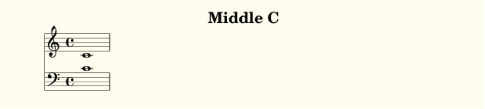

Core concepts
================

Piece
--------------

When a piece of music is written in LilyLib, it is written as a subclass of the LilyLib class `Piece`. `Piece` is a somewhat powerful class, and you can see the source code in `piece.py`, but for now, we'll look at the two functions all custom pieces must overwrite; `details` and `write_score`. To illustrate, here's the code for a piece that is just middle C played in both hands:

::

	from piece import Piece
	from points import note

	class MiddleC(Piece):

	    def details(self):
	        self.title = "Middle C"

	    def write_score(self):
	        self.score["treble"] = note("c`", 1)
	        self.score["bass"] = note("c`", 1)

	if __name__ == "__main__":
	    MiddleC()

This is what this looks like when it's compiled (via Lilypond) to a pdf:

Let’s go through this line by line. First we import the base class Piece from LilyLib.

::

	from piece import Piece

This is critical because otherwise python doesn’t know what a Piece is. The next line is more python syntax that declares out intention to make a new Piece:

::

	class MiddleC(Piece):

We’ve imaginatively called our `Piece` `MiddleC` and we tag `(Piece)` on the end to let python know that `MiddleC` is a kind of `Piece`. If this is confusing to you, you should take an intro to python course and then everything will become clear.

Our new piece contains two functions: `details` and `write_score`. These contain the meta-data and the musical content of the piece respectively and all pieces must have them. In the details function here we are titling our piece “Middle C”, this is the text that will appear at the top of the pdf after compilation, but we can set other things too. To see what, open `piece.py` and look at the `__init__` function right at the top:

::

	class Piece:

	    def __init__(self):
	        self.title = ""
	        self.subtitle = ""
	        self.composer = ""
	        self.opus = ""
	        self.staves = [Treble(), Bass()]
	        self.tempo = "4/4"
	        self.key = "C Major"
	        self.score = {}

	        self.details()

	        self.set_key(self.key)
	        print(self)

From top to bottom this function sets default values for things like the title, subtitle, composer and so on, before later calling `self.details()`. By writing our own details function and having it change these values we can overwrite things like the title, tempo or key signature, and so on.

The `write_score` function does most of the work though, and for complex pieces it will get quite complex too. But, whatever the piece is, the requirement is that it modifies the score of the `Piece` (referred to as `self.score`) adding the contents of the staves. Here our piece has the default staves: one treble, one bass. We refer to these staves by name; `self.score["treble"]` and `self.score["bass"]`.

::

    def write_score(self):
        self.score["treble"] = note("c`", 1)
    	self.score["bass"] = note("c`", 1)

In this demo, we write the score using the function `note`. This function can be found in points.py (it is imported at the top of the demo) and, as the name suggests, it makes notes, one at a time. Here, both staves get the note c`, which is lilypond notation for middle c. They're also given duration `1` which corresponds to a semibreve.

The last bit of code:

::

	if __name__ == "__main__":
	    MiddleC()

is just python for "when this file runs, run the MiddleC class". This ensures that when the file is executed, it prints out the lilypond for the piece. You'll want the same bit of code (swapping out the class name for whatever you called your piece) at the end of any pieces you write.

Single notes, chords and rests
---------------------------------

The above demo uses the `note` function to create a single note. In general, LilyLib discourages the use of atomistic functions like this, in favor of higher-level functions we'll come to later. However, we'll look at a few low-level functions first to get comfortable with what's going on under-the-hood. `note` take three arguments: the tone of the note (effectively the "name" of the sound produced; a combination of letter, accent and pitch), the duration of the note, and, optionally, any ornamentation. It builds notes one at a time, but these are returned in lists and so can be concatenated by adding. Here's a simple example with 4 notes of various tones, durations and ornamentation:

::

    def write_score(self):
        self.score["treble"] = note("c`", 4) + note("e`", '4.', "~") + note("e`", 8) + note("c`", 4, "\\staccato")
        self.score["bass"] = note("c`", 1)

.. image:: _static/core_concepts_fig1.png

We'll discuss tones in more detail shortly. But for now, note that durations are integers, unless they are dotted in which case they are strings. Note also that ornamentation is a string and it follows lilypond conventions, however any slashes must be double to make it through the python interpreter, so `~` starts a tie, whereas `\\staccato` adds the staccato point.

The function `rest` lets you make rests. It behaves just like `note` however you only need to specify a duration (because rests don't have a tone or ornamentation). Here's the same code from above, but switching out the third note for a rest:

::

    def write_score(self):
        self.score["treble"] = note("c`", 4) + note("e`", '4.', "~") + rest(8) + note("c`", 4, "\\staccato")
        self.score["bass"] = note("c`", 1)

.. image:: _static/core_concepts_fig2.png

Just remember that these functions reside in `points.py` and to use them in a piece you need to import them like so:

::

	from piece import Piece
	from points import note, rest

To create chords, `piece.py` includes the function `chord`. Like `note` it accepts a duration and, optionally, ornamentation. However, it lets you specify multiple tones. These tones can either be specified as a python list of multiple tone strings or a single string consisting of multiple tones separated by a single space. The file `demo_c_major_chord.py` shows both:

::

	from piece import Piece
	from points import chord

	class CMajorChord(Piece):

	    def details(self):
	        self.title = "C Major Chord"

	    def write_score(self):
	        self.score["treble"] = chord("c` e` g` c``", 1)
	        self.score["bass"] = chord(["c,", "c"], 1)

	if __name__ == "__main__":
	    CMajorChord()

.. image:: _static/core_concepts_demo_chord.png

Multiple notes, chords and rests
-------------------------------------

The functions `note`, `chord` and `rest` each return a single item, but each function has a corresponding function that returns multiple items. These are called `notes`, `chords` and `rests`, respectively. All of them behave just like their singular counterparts, but take lists of arguments. Let's start with `rests`. In this case, the only argument is the duration of the rests and so the user must supply a list of these durations (or a string of multiple durations separated by spaces). For example:

::

    def write_score(self):
        self.score["treble"] = rests([2, 4, 8, 16, 32, 32])
        self.score["bass"] = note("c`", 1)

.. image:: _static/core_concepts_rests.png

`notes` behaves similarly. You can provide a list of tones, a list of durations or a list of ornamentation (all of which can either be a list or a single string with spaces separating the multiple values). Which ever list is longest determines the total number of notes created, and shorter lists are cycled to reach the length of the longest list. This helps efficiency, so if you want multiple notes with different tones, but the same duration and ornamentation, you only need list out the tones:

::

	def write_score(self):
		self.score["treble"] = notes("c` d` e` f`", 4)
		self.score["bass"] = notes("c` g e c", 4)

.. image:: _static/core_concepts_notes1.png

Here's a more complicated example:

::

	def write_score(self)
		self.score["treble"] = notes('c` c` f` e`', '4 8 4. 4', "~   ") * 2
		self.score["bass"] = notes('c g g c', '4. 8 8 4.', " ~") * 2

.. image:: _static/core_concepts_notes2.png

There's a couple of things to note here: First, the durations are specified as a single string separated by spaces. Second, ornamentation is a single string too, but excess whitespace is used to give some notes no ornamentation at all. So in the treble clef `"~   "` means start a tie on every 4th note, starting with the first. While in the bass clef, `" ~"` means start a tie on every other note, starting with the 2nd. Lastly, because all these functions return lists of notes/rests/etc. you can multiple the result to continue the pattern. Here it is multipled by 2, doubling the passage.

The `notes` function can also return a mix of rests and notes, and rests are indicated by either whitespace (in a single string) or an empty list (`[]`) in a list. To illustrate:

::

    def write_score(self):
		self.score["treble"] = notes("c`  e` ", 4)
		self.score["bass"] = notes(["c`", [], [], "c"], 4)

Points
----------

Tones
----------

