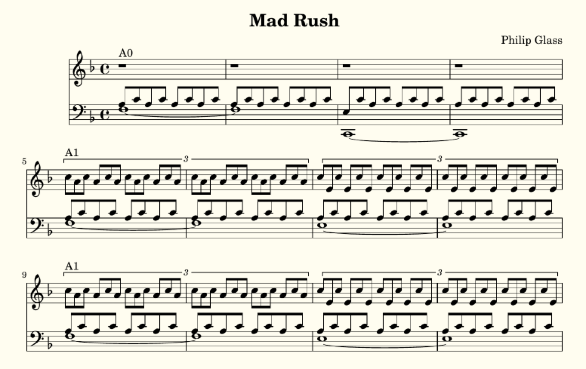
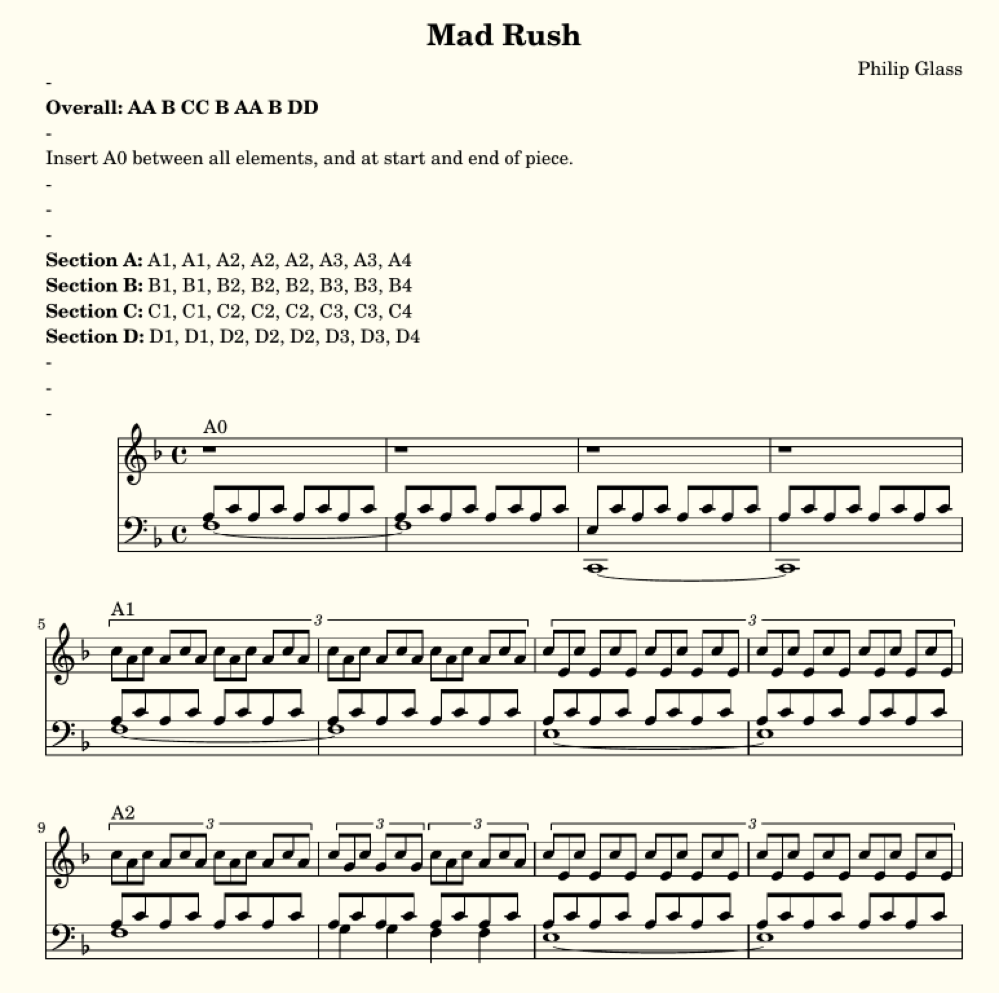
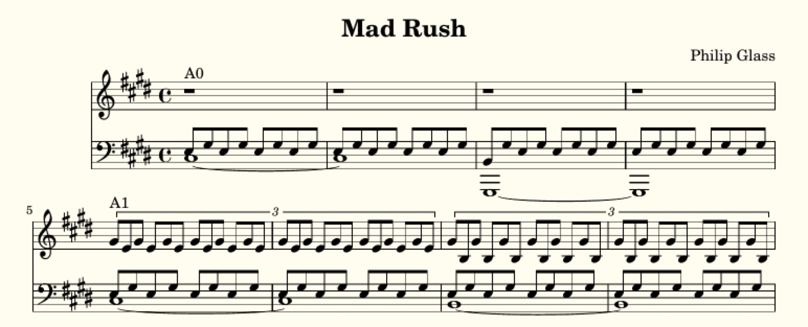

Mad Rush
===========

Mad Rush, by Philip Glass, is a great piece to show how LilyLib can compress music. Below I describe how the demo constructs the piece, and then how we can transpose it to any starting key.

Structure
-----------

While the piece is long, it actually as a very simple structure. There are 4 main elements: (A) a quiet passage with quavers set against triplets, (B) a loud, fast section, (C) a hybrid of A and B, and (D) a modification of A. These are structured as AA B CC B AA B DD, with a small subsection linking all of them (which we'll call A0). We can express this structure as follows:

::

        order = [A, A, B, C, C, B, A, A, B, D, D]
        structure = ['A0']
        for item in order:
            structure += [item, 'A0']

Section A
-------------

But, we need to actually describe the contents of the sections A through D too. Each section has a similar harmonic progression, being composed of 4 subunits (let's label them 1 through 4) and they are played in the following order: 1, 1, 2, 2, 2, 3, 3, 4. Using section A as an example, we can describe this as follows:

::

        A = ['A1', 'A1', 'A2', 'A2', 'A2', 'A3', 'A3', 'A4']

Now we need to actually describe the music itself. As noted above, section A combines quavers in the left hand with triplets in the right. The actual notes being played don't change much other than shifting between a small number of chords. Let's start by listing those chords:

::

    def create_chords(self):
        self.aI = self.arpeggio('f', 6)
        self.aiii = arpeggio('e', 6, 'A Minor')
        self.aiii7 = pattern(arpeggio7('g', 7, 'A Minor'), 1, 2, 3, 5, 6, 7)
        self.aii = arpeggio('g', 6, 'G Minor')
        self.aii7 = ['f'] + subset(self.aii, 2, 6)

Here those chords are named according to their relationship to the overall key signature (F Major). Next we define two functions that take in pairs of notes and return them as alternating quavers or triplets, filling the number of bars specified:

::

        def triplet_bar(note_pair, bars=1):
            return triplets(rep(notes(note_pair, 8), int(6 * bars)))

        def doublet_bar(note_pair, bars=1):
            return rep(notes(note_pair, 8), int(4 * bars))

Next, we create a motif function that takes the chords and passes their notes to these two functions. Exception it's not quite as easy, as the motif is not always exactly the same, and treats the chords somewhat differently, with a few tweaks involved too. The resulting function is a little complex, so let's break it up. First, we define the function, and it takes a chord, the number of bars and any tweaks as it's arguments. It also makes an empty dictionary called motif that will store the created motif:

::

        def A_motif(chord, bars, *tweaks):
            motif = {}

Next we create the right hand:

::

            if 'no treble' in tweaks:
                motif['treble'] = rep(rest(1), bars)
            elif chord == self.aI:
                motif['treble'] = triplet_bar(pattern(chord, [6, 5]), bars=bars)
            elif chord == self.aii and 'low triplets' in tweaks:
                motif['treble'] = triplet_bar(pattern(chord, [5, 4]), bars=bars)
            else:
                motif['treble'] = triplet_bar(pattern(chord, [6, 4]), bars=bars)

Conditional on the chord and tweaks this takes two of the 4th, 5th and 6th notes of the chord and passes them to the triplet_bar function. Note there's a tweak to silence the right hand entirely. Next we make the left hand:

::

            motif['bass1'] = doublet_bar(pattern(chord, 2, 3), bars=bars)

            if 'crotchet bass' in tweaks:
                motif['bass2'] = rep(note(select(chord, 1), 4), int(bars * 4))
            else:
                motif['bass2'] = rep(note(select(chord, 1), 1, phrasing="~"), bars)
                if 'extend tie' not in tweaks:
                    motif['bass2'][-1].phrasing = ""

            if 'low first' in tweaks:
                motif['bass1'][0] = chord[0]
                motif['bass2'] = self.transpose(motif['bass2'], -9, "scale")

This has two voices, one that contains alternating quavers (bass1) and another that contains held notes or crotchets (bass2), this doesn't vary conditional on the chord, but there are plenty of tweaks. Lastly, we use this function to build the differnent elements of section A, as well as A0, the briding subsection that links all sections:

::

        sections['A0'] = join(A_motif(self.aI, 2, 'no treble'), A_motif(self.aiii, 2, 'no treble', 'low first'))
        sections['A0']['treble'] = time_signature('4/4', sections['A0']['treble'])
        sections['A1'] = join(A_motif(self.aI, 2), A_motif(self.aiii, 2))
        sections['A2'] = join(A_motif(self.aI, 1), A_motif(self.aiii7, 0.5, 'crotchet bass'), A_motif(self.aI, 0.5, 'crotchet bass'), A_motif(self.aiii, 2))
        sections['A3'] = join(A_motif(self.aii, 1, 'low triplets', 'extend tie'), A_motif(self.aii, 1), A_motif(self.aI, 2))
        sections['A4'] = join(A_motif(self.aii, 1, 'low triplets'), A_motif(self.aii7, 0.5, 'crotchet bass'), A_motif(self.aii, 0.5, 'crotchet bass'), A_motif(self.aI, 2))

This is all quite readable...ish. Note that A0 has a tempo change stuck at the start, this is because sometimes this section follows other sections that are in a different time signature.

I'll leave reading through sections B, C and D up to you, but it's basically the same principle. The resulting music looks like this:

Summarizing
------------

The sheet music looks good, but its long (19 pages!) and very repetitive. What can we do to improve this? The solution is to use various markings and indicate whether the player should move between them. However, traditional sheet music is not really great at this and the result is still long and clunky. We can do better: we can print each sub-unit once only (with a label) and then provide a text description at the top of the piece describing the structure. Printing each element once only is easy, we just print the dictionary of subunits directly:

::

        if self.summary:
            sections_to_print = sections
        else:
            sections_to_print = flatten(structure)

Text can be added at the top with the *subtext* function:

::

    def subtext(self):
        if self.summary:
            return"""
                \\markup {
                    \\column {
                        \\line { - }
                        \\line {\\bold {Overall:} \\bold{AA B CC B AA B DD}}
                        \\line { - }
                        \\line {Insert A0 between all elements, and at start and end of piece.}
                        \\line { - }
                        \\line { - }
                        \\line { - }
                        \\line {\\bold {Section A:} A1, A1, A2, A2, A2, A3, A3, A4}
                        \\line {\\bold {Section B:} B1, B1, B2, B2, B2, B3, B3, B4}
                        \\line {\\bold {Section C:} C1, C1, C2, C2, C2, C3, C3, C4}
                        \\line {\\bold {Section D:} D1, D1, D2, D2, D2, D3, D3, D4}
                        \\line { - }
                        \\line { - }
                        \\line { - }
                    }
                }"""
        else:
            return ""

This uses lilypond markup language. There's a bunch of empty line breaks, because this causes sections A, B, C and D to (almost) fall on a single page each which is really pleasing (and yes, we get down from 19 to just 4 pages). Here's what the new sheet music looks like:

Keyless music
---------------

This is another (pointlessly) advanced feature. So we've written the piece, and it's in a specific key (F Major in this case). But, LilyLib supposedly "understands" music, so can't we ask it to write the same music in a different key? The answer is yes, and it's actually quite simple, but it's perhaps not how you imagine.

A first attempt, might just be to change *self.key* in the details function to something else, say E Major. But this won't work. What it does is tell the piece to behave in accordance with E Major (so F sharp instead of F), but some of the piece will then no longer make sense. For instance the very first chord is:

::

	self.aI = self.arpeggio('f', 6)

This makes sense in F Major, but in E Major it doesn't: we ask for the arpeggio to start on F, but an arpeggio in E Major doesn't include an F, and neither does the key signature. Recognizing this, LilyLib will raise an error.

Given this, a second attempt might be to write the piece in F Major and then use the *transpose* function to shift it. This will work (assuming you shift via semitones). However, there are two problems: (1) the printed key signature is not changed, so you'll end up with music full of accidentals and the actual harmonic centre of the transposed music will be totally obscured, and (2) because this technique preserves the relationships between all notes it can't change music from major into minor (or vice-versa), for instance changing this piece into F Minor.

OK, so here's how to actually do it. First, set the key to whatever you want in the *details* function (as above), but then, and this is the mildly tricky bit, rewrite the chords such that the notes therein are not named. Instead the notes need to be defined relative to a start note that is dependent on the key. This is a little tricky, so let's revisit the *aI* chord, but this time with no explicit key:

::

	self.aI = self.arpeggio(self.key.root, 6)

Note that *'f'* has been replaced with *self.key.root*. We saw in an earlier section that the root of a key is the letter of it's start note (so 'f' for F Major/Minor and so on). The root can be used to create notes, and because it has no pitch markings it starts in the octave below middle C, which is exactly what we want in this case (we could add pitch indications for other starting points).

The other chords are defined relative to the same root, or by reference to this chord itself. To illustrate, here's the next chord *aiii*, first limited to F Major, then keyless:

::

    self.aiii = arpeggio('e', 6, 'A Minor')
    self.aiii = [self.transpose(t, -1) if letter(t) == self.key.root else t for t in self.aI]

In the first case the start note is set as 'e' and the key as A Major, in the second case the chord is defined totally differently: we take the initial chord and copy it note for note, except, if the note falls on the root note of the piece it is transposed down one note in the scale.

We contiue this process, and in total there are 14 chords that need to be defined this way. But with this done, the entire process is complete. All the chords are defined, ultimately, relative to the key the piece is in, and so by changing the key, the chords (and thus all the music) is changed accordingly. As an example, here's what the piece looks like in C-Sharp Minor:

